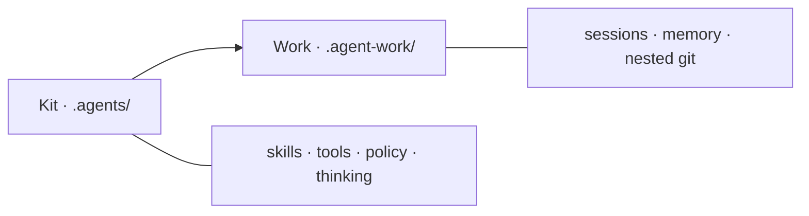

# Simple Skills

<p align="center">
  
</p>

<p align="center">
  <a href="https://github.com/truongnat/simple-skills/actions/workflows/ci.yml"></a>
  &nbsp;
  <a href="https://pypi.org/project/simple-skills/"></a>
  &nbsp;
  <a href="https://pypi.org/project/simple-skills/"></a>
  &nbsp;
  <a href="https://pypi.org/project/simple-skills/"></a>
  &nbsp;
  
  &nbsp;
  
</p>

<p align="center">
  
  
  
  
  
</p>

<p align="center">
  <b>Agent kit for work that ships</b><br>
  <code>think → design → plan → execute → review → done</code>
</p>

<p align="center">
  <a href="#install">Install</a> ·
  <a href="#mental-model">Model</a> ·
  <a href="#paths">Paths</a> ·
  <a href="#thinking-methods">Thinking</a> ·
  <a href="docs/guides/START_HERE.md">Start here</a> ·
  <a href="docs/guides/WHAT_NEXT.md">What next</a>
</p>

---

## Install

```bash
pipx install simple-skills
cd your-project && sk install
sk doctor
```

Also: `uv tool install simple-skills`.

| Profile | What you get |
| :-- | :-- |
| **`core`** (default) | Lifecycle skills + shared policy |
| `office` | Office file skills |
| `ba` | BA / specify / wireframe pack |
| `frontend` · `backend` · `all` | Domain skill sets |

```bash
sk install --profile ba
sk uninstall --yes
```

<details>
<summary><b>From git / curl</b></summary>

```bash
pipx install git+https://github.com/truongnat/simple-skills.git
curl -fsSL https://raw.githubusercontent.com/truongnat/simple-skills/main/i | bash
```

</details>

Reinstall keeps `.agents/settings.yaml`. Then run skill **`init`** once.

---

## Mental model

<p align="center">
  
  
  
</p>



| | Path | Owns |
| :-- | :-- | :-- |
| **Kit** | `.agents/` | Installer-owned rules & skills |
| **Work** | `.agent-work/` | Session truth (auto-gitignored) |
| **CLI** | `sk` | install · doctor · uninstall |

Progress = `TASKS.md` + `session.sh status`. Artifacts only under sessions. Blocking → **Confirm-first**.

---

## Paths

<p align="center">
  
  
  
</p>

| | When | Flow |
| :-- | :-- | :-- |
| **Quick** | Tiny clear fix | `quick-fix` → execution → review → done |
| **Lite** | Small feature | brainstorming → planning → sync → … |
| **Full** | Unclear / multi-surface | Full lifecycle · `business-analysis` · design |

Lite/Full use **Step ledger** + **Spec quality** (not Quick).

```bash
bash .agents/tools/session/session.sh status
python .agents/tools/session/validate_artifacts.py
```

---

## Thinking methods

<p align="center">
  
  
  
  
  
  
</p>
<p align="center">
  
  
  
  
  
  
</p>

Session-wide — **not** report titles. Detail: [docs/thinking/README.md](docs/thinking/README.md)

```text
Outcome-first → IPO → Make-explicit → SSOT → Small-batch → Feedback loop
→ Default path first → Reversible → Standardize → Handoff → Evidence
→ Bottleneck → (5W1H) → Vital few
```

Fold into `Goal` / `Verify` / `Handoff`. No `OUTCOME.md` / `HANDOFF.md`.

---

## HTML · Docs · Develop

<p align="center">
  
  
  
</p>

- Theme: [DESIGN_SYSTEM.md](docs/conventions/DESIGN_SYSTEM.md) · seed `VISUAL_DECISION.template.html`
- Docs map: [docs/README.md](docs/README.md)
- Start: [START_HERE.md](docs/guides/START_HERE.md)

```bash
pip install -e ".[dev]"
python scripts/validate_skills.py && pytest -q
```

Python ≥ 3.11 · MIT · [truongnat/simple-skills](https://github.com/truongnat/simple-skills)
