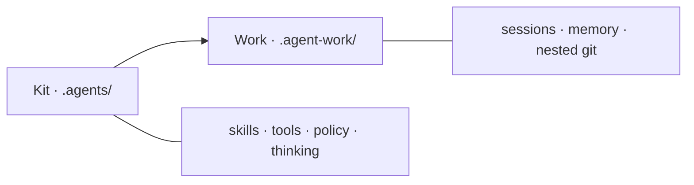

<h1 align="center">Simple Skills</h1>

<div align="center">
<pre>
╔══════════════════════════════════════════════════════════╗
║                                                          ║
║   ____  _                 _         ____  _    _ _       ║
║  / ___|(_)_ __ ___  _ __ | | ___   / ___|| | _(_) |___   ║
║  \___ \| | '_ ` _ \| '_ \| |/ _ \  \___ \| |/ / | / __|  ║
║   ___) | | | | | | | |_) | |  __/   ___) |   <| | \__ \  ║
║  |____/|_|_| |_| |_| .__/|_|\___|  |____/|_|\_\_|_|___/  ║
║                     |_|                                  ║
║                                                          ║
║     think → design → plan → execute → review → done      ║
║                                                          ║
╚══════════════════════════════════════════════════════════╝
</pre>
</div>

<p align="center">
  <a href="https://github.com/truongnat/simple-skills/actions/workflows/ci.yml"></a>
  &nbsp;
  <a href="https://pypi.org/project/simple-skills/"></a>
  &nbsp;
  = 3.11">
  &nbsp;
  <a href="https://pypi.org/project/simple-skills/"></a>
  &nbsp;
  
  &nbsp;
  
</p>

<p align="center">
  
  
  
  
</p>

<p align="center">
  <b>Agent kit for work that ships</b><br>
  <code>think → design → plan → execute → review → done</code>
</p>

<p align="center">
  <a href="#what-is-this">What</a> ·
  <a href="#install">Install</a> ·
  <a href="#quick-start">Quick start</a> ·
  <a href="#profiles">Profiles</a> ·
  <a href="#mental-model">Model</a> ·
  <a href="#thinking-methods">Thinking</a> ·
  <a href="docs/guides/START_HERE.md">Start here</a>
</p>

---

## What is this?

**Simple Skills** is an agent kit that gives AI coding assistants structured workflows for real work. Instead of vague prompts, you get:

- **66 skills** across 5 profiles (core, office, BA, frontend, backend)
- **12 thinking methods** for better decision-making
- **Session management** with automatic git integration
- **Artifact validation** to ensure quality
- **Smart install** that handles conflicts gracefully

Perfect for teams who want AI assistance that actually ships.

---

## Install

The easiest way to install and manage Simple Skills across **all operating systems** (macOS, Linux, Windows) is using `pipx` or `uv`.

### 1. Install the global CLI tool
```bash
pipx install simple-skills
# or: uv tool install simple-skills
```

### 2. Install skills into your project
Navigate to your project directory and run:
```bash
cd your-project
sk install
```
*(Note: Use `sk install --agent claude` to install into `.claude` instead of the default `.agents` directory).*

### Available Commands
```bash
# Install everything (replaces existing directory)
sk install

# Update your skills from upstream (keeps your custom skills safe)
sk update

# Check if your project has all required configuration and docs
sk doctor
```

<details>
<summary><b>Fallback: Install without Python/pipx</b></summary>

If you don't have Python or pipx, you can download and run the installer script directly:

**macOS / Linux:**
```bash
curl -fsSL https://raw.githubusercontent.com/truongnat/simple-skills/main/install.sh -o install.sh
bash install.sh install
```

**Windows:**
```powershell
iwr -useb https://raw.githubusercontent.com/truongnat/simple-skills/main/install.ps1 -OutFile install.ps1
.\install.ps1 install
```
</details>

---

## Quick start

After installation, run the **`init`** skill once to set up your project:

```bash
# In your AI assistant, say:
"Use the init skill to set up this project"
```

Then choose your path based on the task:

| Task size | When to use | Flow |
| :-- | :-- | :-- |
| **Quick** | Tiny clear fix | `quick-fix` → execution → review → done |
| **Lite** | Small feature | brainstorming → planning → sync → execute → review |
| **Full** | Unclear / multi-surface | Full lifecycle · business-analysis · design |

Lite/Full paths use **Step ledger** (track each workflow step) and **Spec quality** (validate artifacts before moving on) to ensure nothing falls through the cracks.

Check progress anytime:

```bash
bash .agents/tools/session/session.sh status
```

---

## CLI reference

The `sk` CLI is beautifully simple:

```bash
# Install everything into the default .agents folder
sk install

# Install for a specific agent provider (e.g. into .claude)
sk install --agent claude

# Update your skills from upstream (keeps your custom skills safe)
sk update --agent claude

# Check if your project has all required configuration and docs
sk doctor --agent claude
```

That's it. No complicated flags needed.

---

## Mental model

<p align="center">
  
  
  
</p>



| | Path | Purpose |
| :-- | :-- | :-- |
| **Kit** | `.agents/` | Installer-owned: skills, tools, policy, thinking methods |
| **Work** | `.agent-work/` | Your session truth: tasks, memory, artifacts (auto-gitignored) |
| **CLI** | `sk` | Commands: `install`, `doctor`, `uninstall` |

**Key principle:** Progress lives in `TASKS.md` + `session.sh status`. Artifacts only under sessions. Blocking changes require confirmation.

---

## Thinking methods

<p align="center">
  
  
  
  
  
  
</p>
<p align="center">
  
  
  
  
  
  
</p>

These are session-wide principles, **not** report section titles. They guide every decision:

```text
Outcome-first → IPO → Make-explicit → SSOT → Small-batch → Feedback loop
→ Default path first → Reversible → Standardize → Handoff → Evidence
→ Bottleneck → (5W1H) → Vital few
```

**How to use:** Fold these into `Goal` / `Verify` / `Handoff` sections. No separate `OUTCOME.md` or `HANDOFF.md` files needed.

Full details: [docs/thinking/README.md](docs/thinking/README.md)

---


## HTML · Docs · Develop

<p align="center">
  
  
  
</p>

- **Design system:** [DESIGN_SYSTEM.md](docs/conventions/DESIGN_SYSTEM.md) · seed `VISUAL_DECISION.template.html`
- **Docs map:** [docs/README.md](docs/README.md)
- **Getting started:** [START_HERE.md](docs/guides/START_HERE.md)
- **What's next:** [WHAT_NEXT.md](docs/guides/WHAT_NEXT.md)

### Development setup

```bash
pip install -e ".[dev]"
python scripts/validate_skills.py && pytest -q
```

---

<p align="center">
  <b>Python ≥ 3.11 · MIT License</b><br>
  <a href="https://github.com/truongnat/simple-skills">github.com/truongnat/simple-skills</a>
</p>
