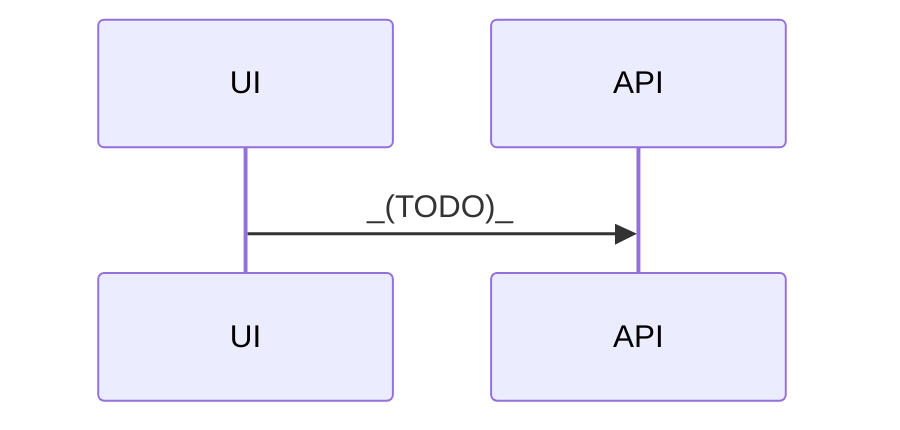

# API BA

> Seeded by `api-ba`. Headings English; prose = `settings.language`.

## Executive summary

- _(TODO)_

## Developer overview

| Field | Value |
|---|---|
| Mode | api-doc / api-map / api-assess / api-design / api-checklist / api-test / api-readiness |
| Status | Draft / Ready / Blocked |
| Next action | _(TODO)_ |

## Mode

`_(mode)_`

## Sources

| ID | Name | Type | Date/version | Notes |
|---|---|---|---|---|
| S-001 |  | OpenAPI / PDF / portal |  |  |

## Business summary

_(api-doc)_

| Capability | Endpoint / op (if known) | Business meaning | Limits / caveats |
|---|---|---|---|
|  |  |  |  |

## Mapping (api-map)

| API field / resource | System data | Screen / UX | Notes |
|---|---|---|---|
|  |  |  |  |

## Assess (api-assess)

| Option | Pros | Cons | Recommendation lean |
|---|---|---|---|
| Build |  |  |  |
| Buy / integrate |  |  |  |

**Recommendation:** _(Build / Integrate / Hybrid)_ — _(why)_

## Design (api-design)

| Flow | Producer | Consumer | Contract notes |
|---|---|---|---|
|  |  |  |  |

Sequence / collaboration notes:

## Checklist (api-checklist)

| ID | Check | Area | Priority | Notes |
|---|---|---|---|---|
| CHK-001 | Auth / token expiry | security | P0 |  |
| CHK-002 | Happy path payload | functional | P0 |  |
| CHK-003 | Validation errors | negative | P0 |  |
| CHK-004 | Rate limit / timeout | resilience | P1 |  |

## Test plan (api-test)

| ID | Case | Method/path | Data | Expected | Automation |
|---|---|---|---|---|---|
| AT-001 |  |  |  |  | Bruno / manual |

### Collection outline (Bruno / Postman)

| Request | Folder | Auth | Notes |
|---|---|---|---|
|  |  |  | no secrets in file |

## Readiness (api-readiness)

| Gate | Result (Pass/Fail/Unknown) | Evidence |
|---|---|---|
| Docs complete |  |  |
| Auth verified |  |  |
| Happy path verified |  |  |
| Error contracts verified |  |  |
| Monitoring / runbook |  |  |
| Rollback plan |  |  |

**Go-live lean:** Ready / Ready with risks / Not ready

## Auth & environments

| Topic | Finding |
|---|---|
| Auth |  |
| Sandbox / prod |  |
| Rate limits |  |

## Risks

| ID | Risk | Impact | Mitigation |
|---|---|---|---|
|  |  |  |  |

## Open questions

| Question | Owner | Blocking |
|---|---|---|
|  |  | Yes/No |

## Handoff

_(basic-design / ba-test / tester / …)_
