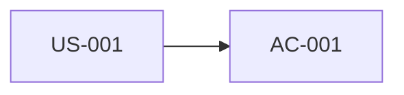

# Knowledge graph

> Seeded by `ba-kg` (`/kg`). Headings English; prose = `settings.language`.

## Executive summary

- _(TODO)_

## Developer overview

| Field | Value |
|---|---|
| Status | Draft / Ready / Blocked |
| Nodes | _(count)_ |
| Edges | _(count)_ |
| Orphans | _(count)_ |
| Next action | _(TODO)_ |

## Focus question

_(optional)_

## Nodes

| ID | Type | Title | Source artifact |
|---|---|---|---|
| US-001 | story |  | USER_STORIES.md |

## Edges

| From | Rel | To | Source |
|---|---|---|---|
| US-001 | has_ac | AC-001 | AC.md |

## Graph

## Orphans

| ID | Why orphan | Suggested link |
|---|---|---|
|  |  |  |

## Query answers

_(answers to focus question, with node IDs)_

## Open questions

| Question | Owner | Blocking |
|---|---|---|
|  |  | Yes/No |

## Handoff

`gap-analysis` / `ba-dashboard` / …
