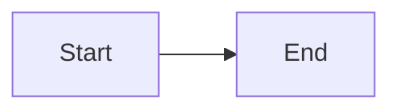

# Business model diagram

> Seeded by `biz-model`. Headings English; prose = `settings.language`.

## Executive summary

- _(TODO)_

## Developer overview

| Field | Value |
|---|---|
| Diagram | sequence / activity / activity-swimlane / bpmn / state / erd / usecase-diagram |
| Format | mermaid / plantuml |
| Status | Draft / Ready / Blocked |
| Next action | _(TODO)_ |

## Diagram

`_(mode)_`

## Format

`mermaid` / `plantuml`

## Subject

_(process / object / system)_

## Actors or entities

| Name | Role |
|---|---|
|  |  |

## Trace refs

| ID | Artifact |
|---|---|
| FR-001 | SPEC_SRS / BA / … |

## Diagram source

## Legend

| Symbol / node | Meaning |
|---|---|
|  |  |

## Open questions

| Question | Owner | Blocking |
|---|---|---|
|  |  | Yes/No |

## Limitations

- _(e.g. BPMN-like Mermaid is not Camunda XML; D2/dbdiagram not generated)_

## Handoff

_(next skill)_
