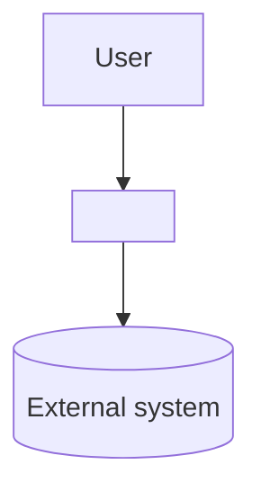
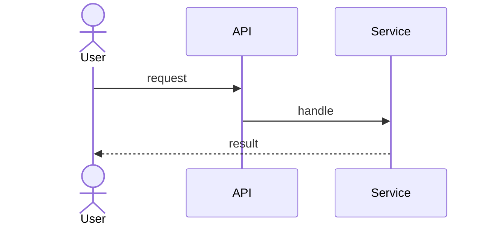

# Architecture — <System>

> Follows **arc42** (12 sections), with **C4** diagrams (Context → Container →
> Component) and, where useful, **4+1 views**. Use Mermaid for diagrams. Cite
> sources; mark `Gap`/`Unknown`. Link decisions to ADRs rather than restating.

- **Status:** draft / reviewed / approved · **Last-synced:** `<commit>`

## 1. Introduction and goals
_(What the system does; top quality goals (3–5); key stakeholders + their concerns.)_

## 2. Architecture constraints
_(Technical, organizational, regulatory constraints that shape the design.)_

## 3. Context and scope
- **Business context** _(actors, external systems, what crosses the boundary)_
- **Technical context** _(protocols, channels, data formats)_


_(C4 Level 1 — System Context.)_

## 4. Solution strategy
_(Key decisions and approaches: technology, decomposition, patterns, how quality
goals are met. Summaries; details go to ADRs / crosscutting concepts.)_

## 5. Building block view
_(C4 Level 2 Container + Level 3 Component decomposition.)_

```mermaid
flowchart TB
  subgraph <System>
    api[API] --> svc[Service]
    svc --> db[(Database)]
  end
```

| Building block | Responsibility | Interfaces | Source |
|---|---|---|---|
| _(container/component)_ | _(…)_ | _(in/out)_ | _(path)_ |

## 6. Runtime view
_(Key scenarios as sequences: happy path + 1–2 error paths.)_



## 7. Deployment view
_(Infrastructure, nodes, environments, mapping of building blocks to infra.)_

## 8. Crosscutting concepts
_(Domain model, persistence, security, error handling, logging, i18n,
transactions, concurrency — the patterns applied system-wide.)_

## 9. Architecture decisions
_(Index of ADRs; link each. Do not restate — see `decisions/ADR-index.md`.)_

| ADR | Title | Status |
|---|---|---|
| ADR-001 | _(…)_ | proposed/accepted/superseded |

## 10. Quality requirements
_(Quality tree + concrete scenarios; tie to SRS §3.7.)_

| Quality | Scenario (stimulus → response) | Measure |
|---|---|---|
| _(e.g. performance)_ | _(…)_ | _(target)_ |

## 11. Risks and technical debt
| Risk / debt | Impact | Mitigation / plan |
|---|---|---|
| _(…)_ | _(…)_ | _(…)_ |

## 12. Glossary
_(Domain + technical terms; link `../01-requirements/glossary.md`.)_

---

Sources: _(code entry points, config, deployment manifests)_
