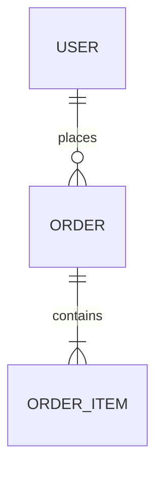

# Data Model — <System>

> Entities, relationships, and constraints. Prefer generating from
> migrations/schema. Cite the source (migration/model file); mark confidence.

- **Store(s):** _(Postgres / … )_ · **Last-synced:** `<commit>`

## Entity–relationship overview

## Entities

### <Entity>
| Field | Type | Constraints | Default | Notes | Source |
|---|---|---|---|---|---|
| id | _(uuid/bigint)_ | PK | _(…)_ | _(…)_ | _(migration)_ |

- **Indexes:** _(…)_  · **Relationships:** _(FKs)_  · **Invariants:** _(…)_

## Retention & lifecycle
_(Soft delete, archival, PII handling, retention windows.)_

## Migrations
_(Where migrations live; ordering/rollback notes.)_
