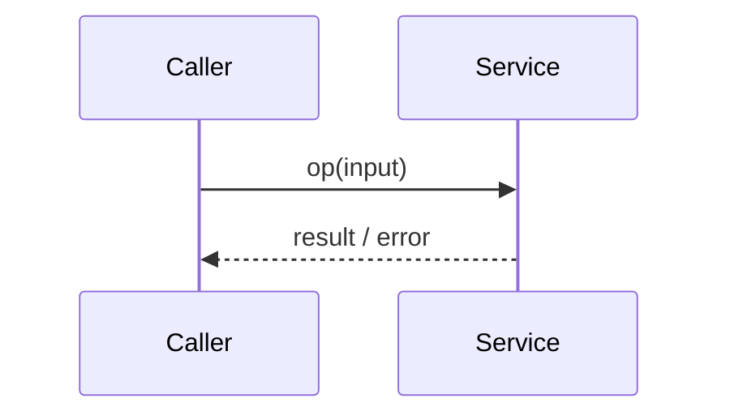

# Low-Level Design (Detailed Design) — <Module / Feature>

> Implementable detail organized as **IEEE 1016-2009** detailed design views:
> Interface, Structure, Interaction, Information, State dynamics, Algorithm, and
> Resource. Prefer content aggregated from `DETAIL_DESIGN.md`. Every element
> cites a source or is marked `Gap`/`Unknown` (confidence: known/inferred).

- **Status:** draft / reviewed / approved · **Last-synced:** `<commit>`
- **Source design:** _(DETAIL_DESIGN.md path, or code evidence)_
- **Traces:** _(SRS FR/NFR IDs, HLD components)_

## Overview
- _(what this module does; key contracts and data)_

## Interface contracts
_(HTTP/RPC/events/CLI/library — whichever applies. One block per operation.)_

| Operation | Input | Output | Errors | Auth | Idempotency | Source |
|---|---|---|---|---|---|---|
| _(METHOD /path or fn())_ | _(fields/types)_ | _(shape)_ | _(codes)_ | _(…)_ | _(…)_ | _(path)_ |

## Data model
| Entity | Field | Type | Constraints | Notes | Confidence |
|---|---|---|---|---|---|
| _(…)_ | _(…)_ | _(…)_ | _(PK/FK/unique/null)_ | _(…)_ | known/inferred |

_(Link `../04-reference/data-model.md` for the full ERD.)_

## Sequences
_(Main happy path + key error paths.)_

## Validation & business rules
| Rule ID | Rule | Applies to | Source |
|---|---|---|---|
| BR-001 | _(…)_ | _(field/op)_ | _(…)_ |

## Error & state handling
_(Error taxonomy, retries, state machine/lifecycle when relevant.)_

## Algorithms / non-obvious logic
_(Only where behavior is not obvious from code; pseudocode + rationale.)_

## Resources & concurrency (IEEE 1016 resource viewpoint)
_(External resources, connections/pools, threads/async, locks, transactions,
memory/quotas — and how contention/limits are handled. N/A + reason if trivial.)_

## Open questions / gaps
| Item | Impact | Owner |
|---|---|---|
| _(…)_ | _(…)_ | _(…)_ |
