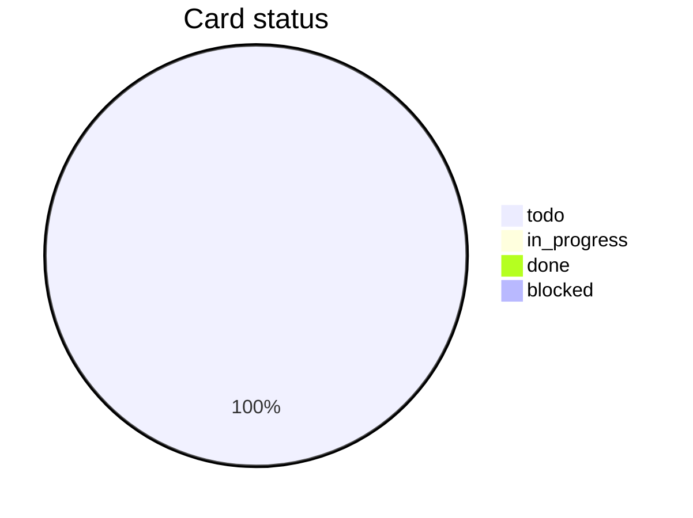

# Tasks

> Filled by planning step-03. **Work inventory first**, then micro-task cards.
> Each card is a **self-contained context package** for execution (BMAD-inspired):
> extract Dev context with `[Source: …]` cites — do **not** invent tech details.
> **Implement feature code before automated tests.** Delete unused placeholders.
> **Progress:** planning seeds Status=`todo`; **execution** updates as work completes.

plan_ref: PLAN.md

## Status legend

| Value | Meaning |
|-------|---------|
| `todo` | Not started |
| `in_progress` | Currently executing |
| `done` | Card AC verified for this task |
| `blocked` | Cannot proceed (note reason under Notes or on the card) |
| `skipped` | Intentionally not done (document why) |

## Work inventory

<!-- Mandatory for Full Mode. One row per implementable unit from design. -->

| Inv | Unit (noun + verb) | Trace (doc § / AC / contract) | Layer |
|-----|--------------------|-------------------------------|-------|
| I-01 | _(TODO — replace; e.g. Add SearchRequest fields: …)_ | _(doc §)_ | model |

## Progress board

<!-- One row per task card. Execution updates Status + Done when a card finishes. -->

| Done | ID | Title | Status |
|------|----|-------|--------|
| [ ] | T-001 | _(short title)_ | todo |
| [ ] | T-002 | _(short title)_ | todo |

## Progress chart

<!-- Do NOT hand-edit. Regenerate from card states:
`bash .agents/tools/session/session.sh status` and paste its pie here. -->

## Execution order

<!-- Must match PLAN.md Task index IDs after cards are written. -->

T-001 → T-002 → _(extend)_

## Notes

- _(optional: blockers, pattern refs, why inventory was split this way)_

## Tasks

### T-001: _(short title — concrete unit, not only a layer)_

- Status: todo
- Trace: _(doc § / AC / contract id — required)_
- Depends: none
- Work items:
  - [ ] 1. _(concrete step: symbol / field / behavior)_
  - [ ] 2. _(concrete step)_
- Description: _(1–2 lines; details live in Work items + Dev context)_
- AC: _(observable outcome — not “works” / “per spec”)_
- Verify: _(command, request, or UI check for this card only)_
- Flow/comment notes: _(where rationale comments are required, or N/A + reason)_
- Files/scope: _(concrete path or create `…/File.ext`)_ (confidence: known | inferred | unknown)
- Out of scope for this card: _(what the next cards own)_

#### Dev context (mandatory — execution reads this first)

<!-- Extract ONLY from DISCUSSION / BA / design / PLAN / repo. Never invent.
Every bullet that states a tech fact must end with `[Source: path#§ or heading]`.
If a category has no guidance in sources, write exactly: `No specific guidance found.` -->

- **Reuse / do not reinvent:** _(existing symbols, helpers, patterns to extend — or `No specific guidance found.`)_
- **Contracts / data:** _(fields, endpoints, types relevant to THIS card — cited)_
- **Constraints:** _(auth, limits, ordering, NFR that bind this card — or none cited)_
- **Guardrails:** _(wrong libs/paths/patterns to avoid — or `No specific guidance found.`)_
- **Gaps:** _(missing source detail; mark inferred vs unknown — do not invent fills)_

### T-002: _(short title)_

- Status: todo
- Trace: _(…)_
- Depends: T-001
- Work items:
  - [ ] 1. _(…)_
  - [ ] 2. _(…)_
- Description: _(…)_
- AC: _(…)_
- Verify: _(…)_
- Flow/comment notes: _(…)_
- Files/scope: _(…)_ (confidence: known | inferred | unknown)
- Out of scope for this card: _(…)_

#### Dev context (mandatory — execution reads this first)

- **Reuse / do not reinvent:** _(…)_
- **Contracts / data:** _(…)_
- **Constraints:** _(…)_
- **Guardrails:** _(…)_
- **Gaps:** _(…)_

<!-- Duplicate ### T-00x as needed. Map ~1 inventory row → 1 card. -->
<!-- Delete unused placeholders. Put automated tests AFTER implement cards. -->
<!-- Keep Progress board rows in sync with card Status and Done checkboxes. -->
