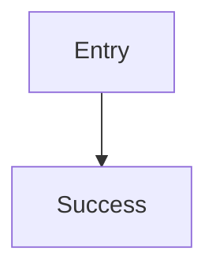

# User flow

> Seeded by `user-flow`. Headings English; prose = `settings.language`.

## Executive summary

- _(TODO)_

## Developer overview

| Field | Value |
|---|---|
| Status | Draft / Ready / Blocked |
| Goal | _(TODO)_ |
| Next action | _(TODO)_ |

## Goal

_(user goal in one sentence)_

## Actor

_(persona / role)_

## Entry

_(channel / screen / deep link)_

## Trace refs

| ID | Artifact |
|---|---|
| US-001 |  |

## Happy path

| Step | User action | System response | Screen / API |
|---|---|---|---|
| 1 |  |  |  |

## Error paths

| Step | Failure | User sees | Recovery |
|---|---|---|---|
|  |  |  |  |

## Edge cases

| Case | Behavior | Notes |
|---|---|---|
|  |  |  |

## Flow diagram

## Open questions

| Question | Owner | Blocking |
|---|---|---|
|  |  | Yes/No |

## Handoff

_(story-spec / biz-model / wireframe P1 / …)_
